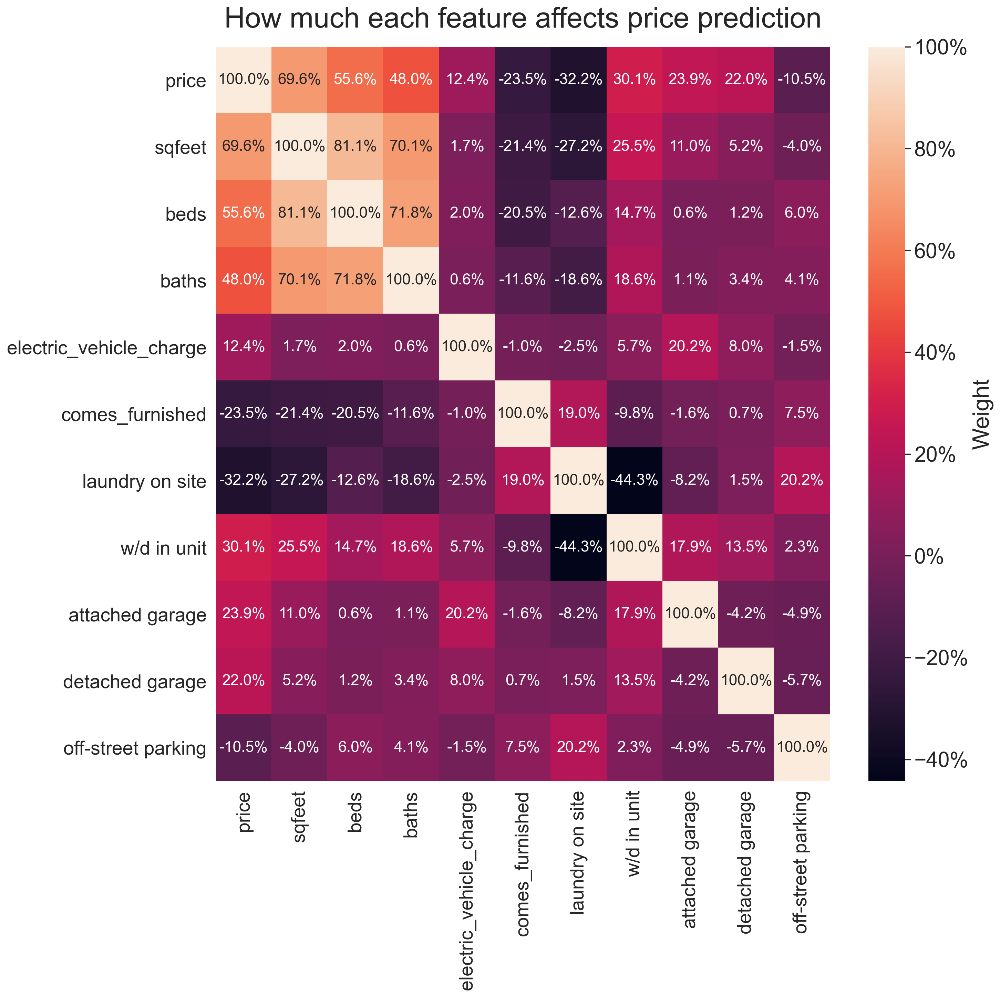
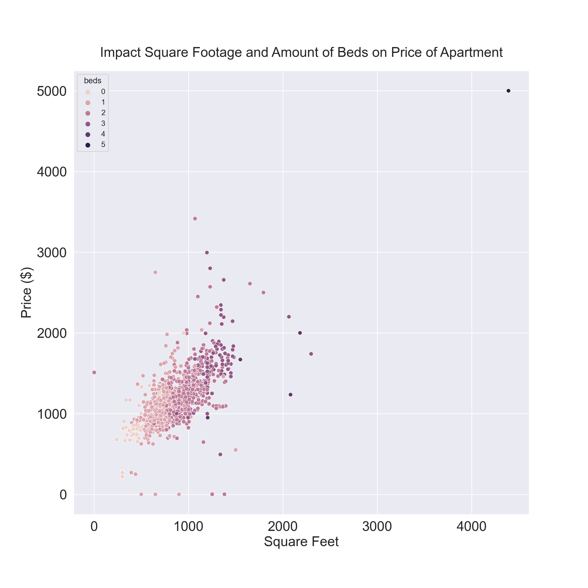
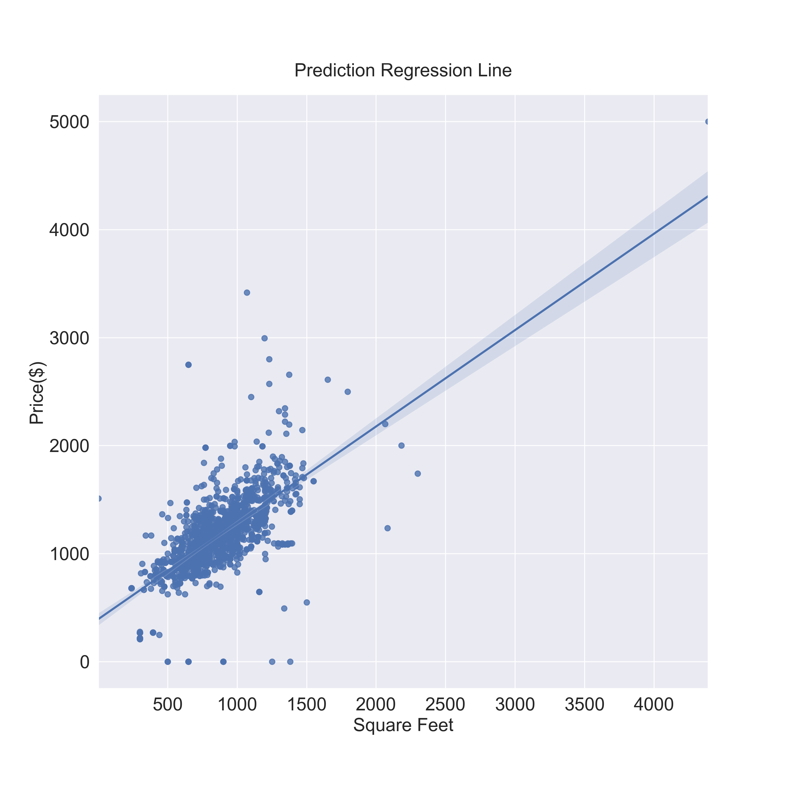

# Phoenix Rent Predictor Model

Machine learning powered web application that predicts apartment prices in Phoenix Arizona based on features of the unit.
[Live Web Application](https://phoenix-rent-predictor.herokuapp.com/)

---

## Table of Contents

- [Phoenix Rent Predictor Model](#phoenix-rent-predictor-model)
  - [Table of Contents](#table-of-contents)
  - [General Information](#general-information)
  - [Accuracy of Predictions](#accuracy-of-predictions)
  - [Technologies Used](#technologies-used)
  - [Sources](#sources)
  - [Get In Touch](#get-in-touch)

---

## General Information

I have been interested in machine learning for a long time and I tend to move every couple of years so I thought it would be incredibly useful to create an application that could give a rough estimate on apartment rental prices.

I built this model using Scikit-learn, Pandas, Numpy, and Jupyter Notebooks. I found the data through the website [Kaggle](https://www.kaggle.com/). A user named [Austin Reese](https://www.kaggle.com/datasets/austinreese/usa-housing-listings) provided a dataset that contained all of the real estate listings on Craigslist.com from the year 2020.

The most challenging part of this project wasn't the actual prediction algorithm, but the cleaning of data and shaping it in a way that it could be useful for my needs. I first started out by narrowing down the dataset to just apartments in Phoenix Arizona. Originally I planned on using both housing and apartment information, but the dataset didn't provide a large enough sample size of houses. Once I cleaned the data into a useable state, I had to filter out what apartment features correlated to strong enough weight to use in the actual model.

The closer to -100% or 100% a feature has on the model, the more or less weight it is given to the overall algorithm. Overall the square footage of an apartment has the highest impact on price, with the number of bedrooms and bathrooms coming second and third respectively.

This was an incredibly fun project to work on, and really helped sharping my machine learning skills. I plan on updating this model as more recent data becomes available.

---

## Accuracy of Predictions

As of September 2021 the final evaluation for the full model that was deployed to the website had an R² score of 70%, a Mean Absolute Error of $108.63, and a Root Mean Squared Error 173.88 dollars.

The model was relatively accuarate, especially when factoring in the discrepancy of housing prices in 2021 from 2020 due to rising costs and material shortages. I hope to update this model using more recent data in the near future.

---

## Technologies Used

- Python
- Scikit-Learn
- Pandas
- Numpy
- Jupyter Notebooks
- Matplotlib

---

## Sources

- [Craigslist Data Set](https://www.kaggle.com/datasets/austinreese/usa-housing-listings)

---

## Get In Touch

If you have any questions about this project please reach out and ask. I had a great time and would love to discuss my findings with you!

[Contact Me](mailto:chris@charrison.dev)
